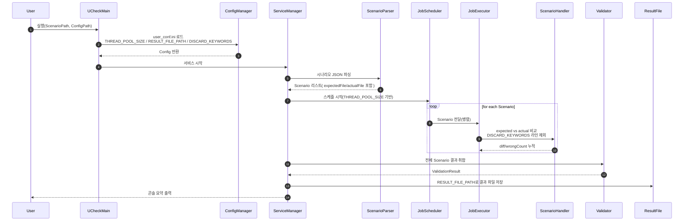

# jchecker
~~~
Validate two files!

1. 결과 파일 산출 가능
2. 비교 무시할 키워드 설정 가능 > 설정된 키워드가 있는 라인의 문장은 비교 대상에서 제외
~~~

## 구조


## 전체 구조(컴포넌트/데이터 흐름) 다이어그램
```mermaid
flowchart TB
  START([START]) --> SP["Scenario Path<br/>(실행 인자)"] --> SM["ServiceManager<br/>전체 오케스트레이션"]

  %% Config
  subgraph CFG["Config"]
    MAIN["UCheckMain<br/>entry point"]
    CM["ConfigManager<br/>user_conf.ini 로드<br/>- THREAD_POOL_SIZE<br/>- RESULT_FILE_PATH<br/>- DISCARD_KEYWORDS"]
  end

  MAIN --> CM --> SM

  %% Scenario parse
  subgraph PARSE["Scenario Loading / Parsing"]
    P["ScenarioParser<br/>시나리오 JSON 파싱"]
    SD["ScenarioDto"]
    CD["CaseDto (N개)"]
    S["Scenario (N개)<br/>id + expectedFile + actualFile"]
  end

  SM -->|1) Register| P --> SD -->|2) Parse Scenario| CD --> S

  %% Validation models & compare
  subgraph COMP["Validation / Compare"]
    VH["ScenarioHandler<br/>line-by-line 비교<br/>DISCARD_KEYWORDS 포함 라인 제외"]
    EM["Expected Model<br/>ValidationModel(fileName, line info)"]
    AM["Actual Model<br/>ValidationModel(fileName, line info)"]
  end

  S --> VH
  EM --> VH
  AM --> VH
  VH -->|5) Add result| AM

  %% Run in parallel
  subgraph EXEC["Parallel Execution"]
    JS["JobScheduler(MAIN)<br/>시나리오 시작/분배"]
    JP["ThreadPool<br/>THREAD_POOL_SIZE 기반"]
    JE["JobExecutor (N개)<br/>Scenario 단위 실행"]
  end

  SM --> JS --> JP --> JE --> VH

  %% Result
  subgraph OUT["Output"]
    V["Validator<br/>3) Add Scenario"]
    VR["ValidationResult<br/>wrongCount/success 등 결과"]
    RF["Result File<br/>RESULT_FILE_PATH(JSON 등)"]
  end

  S --> V --> VR --> SM
  VR --> RF
  SM --> PRINT["6) Print all validation results"] --> STOP([STOP])
```

## 실행 시퀀스(초기화 → 병렬 비교 → 결과 파일)

  
## 실행 예시
~~~
[2022-07-27 07:29:59.028][INFO ] [main] [UCheckMain] Config path: /home/ucheck/ucheck/config/user_conf.ini - (UCheckMain.java:20)
[2022-07-27 07:29:59.236][INFO ] [main] [UCheckMain] ScenarioPath: /root/utgen/scenario/result/aicc_test.json - (UCheckMain.java:27)
[2022-07-27 07:29:59.996][DEBUG] [main]     Get Config [COMMON] > [ID] : [UCHECK_1] - (ConfigManager.java:165)
[2022-07-27 07:30:00.036][DEBUG] [main]     Get Config [COMMON] > [THREAD_POOL_SIZE] : [10] - (ConfigManager.java:165)
[2022-07-27 07:30:00.046][DEBUG] [main]     Get Config [COMMON] > [RESULT_FILE_PATH] : [/root/utgen/scenario/result/aicc_test_result.json] - (ConfigManager.java:165)
[2022-07-27 07:30:00.077][DEBUG] [main]     Get Config [COMMON] > [DISCARD_KEYWORDS] : [Call-ID:,branch=,transactionId=,callId=,timeStamp=,time=,tag=,[2022-,m=audio,Content-Length:] - (ConfigManager.java:165)
[2022-07-27 07:30:00.099][DEBUG] [main] Load [COMMON] config...(OK) - (ConfigManager.java:114)
[2022-07-27 07:30:00.107][INFO ] [main] Load config [/home/ucheck/ucheck/config/user_conf.ini] - (ConfigManager.java:77)
[2022-07-27 07:30:10.181][DEBUG] [main] | ShutDownHookHandler(ShutDownHookHandler_d2a86bb3) is initiated. (target=main) - (ServiceManager.java:172)
[2022-07-27 07:30:42.257][DEBUG] [main] [JobScheduler(MAIN)] [Scenario_1] is started. - (JobScheduler.java:70)
[2022-07-27 07:30:42.320][INFO ] [main] (Id:1) Scenario: Scenario{id='1', expectedModel=ValidationModel{fileName='/root/utgen/scenario/result/expected/sip_stack_uac.log', LastLineNumber=609, curLineNumber=0}, actualModel=ValidationModel{fileName='/root/utgen/logs/sip_stack_uac.log', LastLineNumber=590, curLineNumber=0}, curLineNumber=0, isStarted=true, isSuccess=false, wrongCount=0} - (ServiceManager.java:94)
[2022-07-27 07:30:42.530][DEBUG] [main] [JobScheduler(MAIN)] [Scenario_2] is started. - (JobScheduler.java:70)
[2022-07-27 07:30:42.569][INFO ] [main] (Id:2) Scenario: Scenario{id='2', expectedModel=ValidationModel{fileName='/root/utgen/scenario/result/expected/sip_stack_uas.log', LastLineNumber=491, curLineNumber=0}, actualModel=ValidationModel{fileName='/root/utgen/logs/sip_stack_uas.log', LastLineNumber=537, curLineNumber=0}, curLineNumber=0, isStarted=true, isSuccess=false, wrongCount=0} - (ServiceManager.java:94)
[2022-07-27 07:30:42.884][INFO ] [main] [UCHECK] START - (ServiceManager.java:65)
[2022-07-27 07:31:02.075][WARN ] [MAIN_JobExecutor-1] [2] [!]
[ E (386) : from="200.200.200.83:5080"  ] <-> 
[ A (386) : from="200.200.200.83:5061"  ] - (ScenarioHandler.java:87)
[2022-07-27 07:31:02.189][WARN ] [MAIN_JobExecutor-1] [2] [!]
[ E (387) : to="200.200.200.83:5061"  ] <-> 
[ A (387) : to="200.200.200.83:5080"  ] - (ScenarioHandler.java:87)
[2022-07-27 07:31:02.325][WARN ] [MAIN_JobExecutor-1] [2] [!]
[ E (389) : isSender="false"  ] <-> 
[ A (389) : isSender="true"  ] - (ScenarioHandler.java:87)
[2022-07-27 07:31:02.422][WARN ] [MAIN_JobExecutor-1] [2] [!]
[ E (392) : firstLine="ACK sip:200.200.200.83:5061;transport=UDP SIP/2.0"  ] <-> 
[ A (392) : firstLine="SIP/2.0 200 OK"  ] - (ScenarioHandler.java:87)
[2022-07-27 07:31:02.634][WARN ] [MAIN_JobExecutor-1] [2] [!]
[ E (394) : <![CDATA[ACK sip:200.200.200.83:5061;transport=UDP SIP/2.0 ] <-> 
[ A (394) : <![CDATA[SIP/2.0 200 OK ] - (ScenarioHandler.java:87)
[2022-07-27 07:31:02.957][WARN ] [MAIN_JobExecutor-1] [2] [!]
[ E (400) : Max-Forwards: 70 ] <-> 
[ A (400) : Contact: <sip:200.200.200.83:5061;transport=UDP> ] - (ScenarioHandler.java:87)
[2022-07-27 07:31:03.062][WARN ] [MAIN_JobExecutor-1] [2] [!]
[ E (404) : ]]> ] <-> 
[ A (404) : </message> ] - (ScenarioHandler.java:87)
[2022-07-27 07:31:03.215][WARN ] [MAIN_JobExecutor-1] [2] [!]
[ E (408) : from="200.200.200.83:5080"  ] <-> 
[ A (408) : to="200.200.200.83:5061"  ] - (ScenarioHandler.java:87)
[2022-07-27 07:31:03.338][WARN ] [MAIN_JobExecutor-1] [2] [!]
[ E (414) : firstLine="BYE sip:200.200.200.83:5061;transport=UDP SIP/2.0"  ] <-> 
[ A (414) : > ] - (ScenarioHandler.java:87)
[2022-07-27 07:31:03.487][WARN ] [MAIN_JobExecutor-1] [2] [!]
[ E (415) : > ] <-> 
[ A (415) : <![CDATA[ACK sip:200.200.200.83:5061;transport=UDP SIP/2.0 ] - (ScenarioHandler.java:87)
[2022-07-27 07:31:03.687][WARN ] [MAIN_JobExecutor-1] [2] [!]
[ E (422) : Max-Forwards: 70 ] <-> 
[ A (422) : Route: <sip:200.200.200.83:5061;lr;transport=UDP>,<sip:01033334444@scpas.sktims.net;lr> ] - (ScenarioHandler.java:87)
[2022-07-27 07:31:04.281][WARN ] [MAIN_JobExecutor-1] [2] [!]
[ E (432) : to="200.200.200.83:5080"  ] <-> 
[ A (432) : isSender="false"  ] - (ScenarioHandler.java:87)
[2022-07-27 07:31:04.379][WARN ] [MAIN_JobExecutor-1] [2] [!]
[ E (437) : firstLine="SIP/2.0 200 OK"  ] <-> 
[ A (437) : <![CDATA[BYE sip:200.200.200.83:5061;transport=UDP SIP/2.0 ] - (ScenarioHandler.java:87)
[2022-07-27 07:31:04.425][WARN ] [MAIN_JobExecutor-1] [2] [!]
[ E (439) : <![CDATA[SIP/2.0 200 OK ] <-> 
[ A (439) : CSeq: 2 BYE ] - (ScenarioHandler.java:87)
[2022-07-27 07:31:04.588][WARN ] [MAIN_JobExecutor-1] [2] [!]
[ E (448) : </message> ] <-> 
[ A (448) : ]]> ] - (ScenarioHandler.java:87)
[2022-07-27 07:31:04.757][WARN ] [MAIN_JobExecutor-1] [2] [!]
[ E (452) : to="200.200.200.83:5061"  ] <-> 
[ A (452) : from="200.200.200.83:5080"  ] - (ScenarioHandler.java:87)
[2022-07-27 07:31:04.972][WARN ] [MAIN_JobExecutor-1] [2] [!]
[ E (458) : > ] <-> 
[ A (458) : firstLine="BYE sip:200.200.200.83:5061;transport=UDP SIP/2.0"  ] - (ScenarioHandler.java:87)
[2022-07-27 07:31:05.045][WARN ] [MAIN_JobExecutor-1] [2] [!]
[ E (459) : <![CDATA[BYE sip:200.200.200.83:5061;transport=UDP SIP/2.0 ] <-> 
[ A (459) : > ] - (ScenarioHandler.java:87)
[2022-07-27 07:31:05.298][WARN ] [MAIN_JobExecutor-1] [2] [!]
[ E (466) : Contact: <sip:AICCGW@200.200.200.83:5080> ] <-> 
[ A (466) : Max-Forwards: 70 ] - (ScenarioHandler.java:87)
[2022-07-27 07:31:05.370][WARN ] [MAIN_JobExecutor-1] [2] [!]
[ E (467) : P-Aicc-reinvite: true ] <-> 
[ A (467) : Contact: <sip:AICCGW@200.200.200.83:5080> ] - (ScenarioHandler.java:87)
[2022-07-27 07:31:05.622][WARN ] [MAIN_JobExecutor-1] [2] [!]
[ E (471) : </message> ] <-> 
[ A (471) : ]]> ] - (ScenarioHandler.java:87)
[2022-07-27 07:31:05.840][WARN ] [MAIN_JobExecutor-1] [2] [!]
[ E (475) : to="200.200.200.83:5080"  ] <-> 
[ A (475) : from="200.200.200.83:5061"  ] - (ScenarioHandler.java:87)
[2022-07-27 07:31:06.091][WARN ] [MAIN_JobExecutor-1] [2] [!]
[ E (481) : > ] <-> 
[ A (481) : firstLine="SIP/2.0 200 OK"  ] - (ScenarioHandler.java:87)
[2022-07-27 07:31:06.163][WARN ] [MAIN_JobExecutor-1] [2] [!]
[ E (482) : <![CDATA[SIP/2.0 200 OK ] <-> 
[ A (482) : > ] - (ScenarioHandler.java:87)
[2022-07-27 07:31:06.283][WARN ] [MAIN_JobExecutor-1] [2] [!]
[ E (483) : CSeq: 2 BYE ] <-> 
[ A (483) : <![CDATA[SIP/2.0 200 OK ] - (ScenarioHandler.java:87)
[2022-07-27 07:31:06.687][DEBUG] [MAIN_JobExecutor-1] [JobScheduler(MAIN)] [Scenario_2] is canceled. - (JobScheduler.java:92)
[2022-07-27 07:31:06.760][DEBUG] [MAIN_JobExecutor-1] [2] [Scenario_2] Success to finish the scenario. - (ScenarioHandler.java:105)
[2022-07-27 07:31:08.795][DEBUG] [MAIN_JobExecutor-0] [JobScheduler(MAIN)] [Scenario_1] is canceled. - (JobScheduler.java:92)
[2022-07-27 07:31:08.818][DEBUG] [MAIN_JobExecutor-0] [1] [Scenario_1] Success to finish the scenario. - (ScenarioHandler.java:105)
[2022-07-27 07:31:08.960][WARN ] [ShutDownHookHandler_d2a86bb3] | (ShutDownHookHandler_d2a86bb3) Process is about to quit. (Ctrl+C) - (ServiceManager.java:195)
[2022-07-27 07:31:09.239][DEBUG] [ShutDownHookHandler_d2a86bb3] [JobScheduler(MAIN)] Success to stop all the jobs. - (JobScheduler.java:108)
[2022-07-27 07:31:09.503][DEBUG] [ShutDownHookHandler_d2a86bb3] [JobScheduler(MAIN)] is finished. - (JobScheduler.java:126)
[2022-07-27 07:31:12.365][INFO ] [ShutDownHookHandler_d2a86bb3] [RESULT]
{
  "1": {
    "isSuccess": true,
    "wrongCount": 0
  },
  "2": {
    "isSuccess": false,
    "wrongCount": 25
  },
  "totalScenarioCount": 2
} - (ServiceManager.java:104)
[2022-07-27 07:31:12.453][INFO ] [ShutDownHookHandler_d2a86bb3] [UCHECK] STOP - (ServiceManager.java:108)
[2022-07-27 07:31:12.461][DEBUG] [ShutDownHookHandler_d2a86bb3] | ShutDownHookHandler(ShutDownHookHandler_d2a86bb3)'s target is finished successfully. (target=main) - (ServiceManager.java:184)
~~~
  
